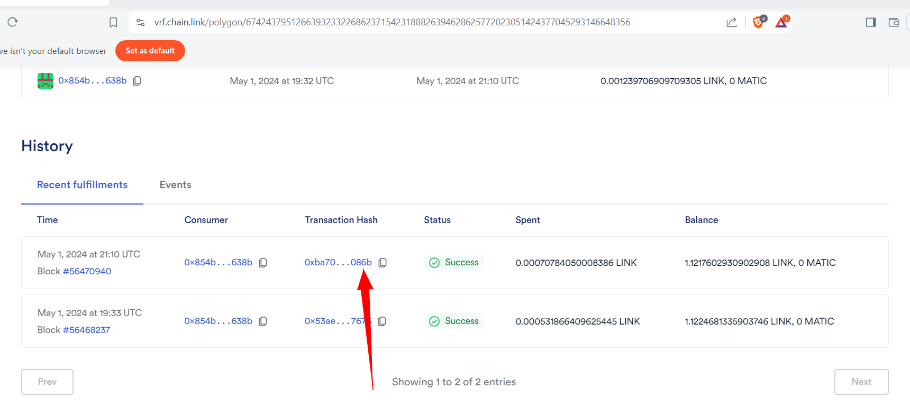
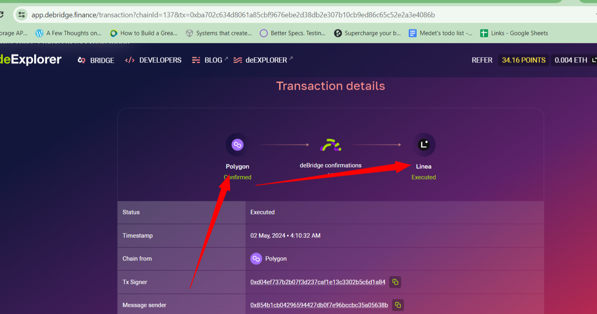
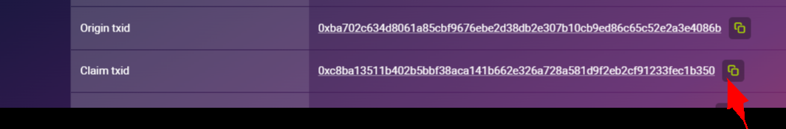
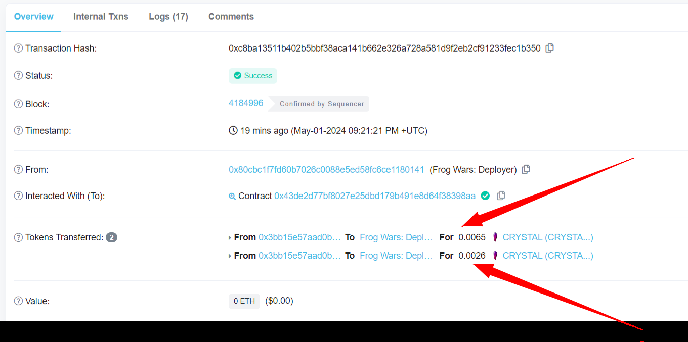

# FrogWards Lottery
Decentralized Lottery.

_DecentralizedLottery Deployed on **Linea MainNet**_ -> [0x3bb15e57aad0ba82c471e3d42ae51bf5f24b6d55](https://lineascan.build/address/0x3bb15e57aad0ba82c471e3d42ae51bf5f24b6d55)
_WinnerAnnouncer Deployed on **Polygon MainNet (POS)**_ -> [0x854b1cb04296594427db0f7e96bccbc35a05638b](https://polygonscan.com/address/0x854b1cb04296594427db0f7e96bccbc35a05638b)

## Instructions for the Admin
1. **On Linea Mainnet**. Start the session:
    [startSession](https://lineascan.build/address/0x3bb15e57aad0ba82c471e3d42ae51bf5f24b6d55#writeContract#F12)
    Arguments:
        `entranceFee` &ndash; Entrance Fee is the initial amount users need to set. It's in the Wei format.
        `interval` &ndash; seconds duration of the lottery.
   https://lineascan.build/address/0x3bb15e57aad0ba82c471e3d42ae51bf5f24b6d55#writeContract#F5
2. **On Linea Mainnet**. For users
    [enterLottery](https://lineascan.build/address/0x3bb15e57aad0ba82c471e3d42ae51bf5f24b6d55#writeContract#F3)
    
3. **On Linea Mainnet**. After interval end. Perform Upkeep that will close the lottery.
    [performUpkeep](https://lineascan.build/address/0x3bb15e57aad0ba82c471e3d42ae51bf5f24b6d55#writeContract#F5)
    
    As the argument set: `0x00`
4. **On Polygon Mainnet**. Now, we need to request the random winner from Chainlink:

   [requestRandomWinner (0x522a1f0b)](https://polygonscan.com/address/0x854b1cb04296594427db0f7e96bccbc35a05638b#writeContract#F7)

    The argument requires attached native tokens. They will be used as a fee for the Oracles that will transfer the random number to the lottery contract on Linea Mainnet.
    You can see the protocol fees here: [Docs.Debridge.Finance/fees and supported networks](https://docs.debridge.finance/the-core-protocol/fees-and-supported-chains#current-flat-fee-for-messages-sent-from-different-chains).

    Use the fee for the Polygon. During the deployment of the smartcontracts, the protocol fee was 0.5 MATIC. Therefore, pass `0.5` as the argument.

5. **Chainlink VRF**, we need to get the transaction id that fulfilled the random number:

   [VRF: SubId: 674243....8356](https://vrf.chain.link/polygon/67424379512663932332268623715423188826394628625772023051424377045293146648356)

   Copy the latest transaction ID.
   
6. **Debridge**, finally we need to claim the execution on the bridge.

   https://app.debridge.finance/transaction?chainId=137&tx= **tx id copied from chainlink**
   

    Login and connect your wallet. Switch to the Linea Mainnet.
    On the page, wait until the block is finalized. For polygon you need to wait 256 blocks. 
    After blocks were finalized, and if you passed the protocol fee, then under the `Linea` you will see the Claim button.
    Click on that. And it will execute the transaction and announce the winner.
7. **Check** 
    If you claimed the transaction, you will see the transaction ID on the same page. Click on that.
    
    will redirect to the blockchain explorer. You will see 2 token transfers.
    First is the winners tokens (50% of the pool), and second is the burning amount (20% of the pool)
    

After transferring the tokens, you can call the `startSession` again to start new lottery.

## How to Setup in your local enviroment :-

### Frontend 
    1. cd frontend
    2. npm install
    3. npm run dev

### Blockchain
    1. cd Smart-Contract
    2. npm install
    3. setup env
    4. npx hardhat test
    5. npx hardhat deploy --network localhost
    
    
    
## Technologies/Frameworks Used :-

### Frontend
1. Next.js
2. Tailwind CSS (For styling)
3. ts-particles (for background animations)
4. Moralis (For web3 integration)
5. Web3uikit (For wallet connect button and notifications)
6. Ethers (For converting value into ethers)
7. Fleek IPFS (For deploying frontend)

## Blockchain
1. Solidity (To develop Smart Contract)
2. Javascript (For deploying scripts)
3. Chai (For testing Smart Contract)
4. Chain-Link (For getting random number and choosing winner after specific time)
5. Rinkeby (Test network)
6. Hardhat
7. ethers
